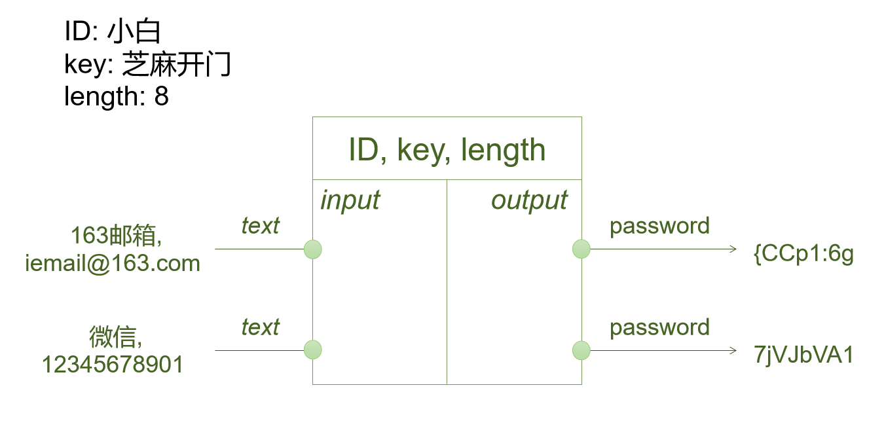

# Linker-A

Linker-A (核心号:019z0M), 用于展示一种密码托管机制的示例程序 (An example program for demonstrating a managed password mechanism.)

Linker, 基于对称加密实现的个人密码托管机制

出发点：使大众能更便捷的使用由自己管理的强密码。

理念：用易操作的流程引导出个人习惯，生成有一定强度的密码

重点：安全 简单 可控 可迁移

措施：通过一个主密码来生成/链接不同账户的子密码

## 加密原理 (重点)

通过身份 ID 和 加密口令(key) 对特定的文本(text)进行对称加密编码并截取适当的长度(length)进而获取到与特定的文本相关联的密码(password)。

对输入的数据进行对称加密等一系列编码操作,输出与输入的数据相对应的密码：

加密的核心是对称加密算法 AES-256，其中 ID 与 IV 关联，key 与 AES 的密钥关联，text 与 AES的加密内容关联，关联方式和实现方法见代码 (main_aes.py)。

Linker 现在成了一种通过对称加密算法构建的私有哈希。

## 灵感来源

“既然可以用密码来锁住密码，那为什么不直接用密码直接来生成密码呢？”

如何给自己各种帐号编一个安全又对自己来说又容易记忆的密码？

几年前我的答案是这样的, 为了防止密码重复带来的安全风险。我为每一个账户的密码设置了一个统一密码规则：用两位字母代表账户的平台 + 账户名前6位 + 一个特殊字符。

假如, 我的 QQ 账号是 123456789 那么 这个 QQ 号的密码就是 QQ123456#。

但是后来我发现了风险，有时候我需要把我的账号发给我的朋友或者其他人使用...根据我上面的规则，一旦知道了某个账号的密码，是很容易猜到其他账号的密码。后面我一直在寻找一个方法，既能统一管理所有账户的密码又能方便获取，直到我了解了哈希、对称加密、非对称加密算法。借由哈希和对称加密算法的实现原理，我构想了一种密码生成机制，

将一个账户的账号和相关信息，通过对称加密，得到与之相关的一段加密码，然后再将这种加密码进行特定规则的编码与ASCII字符进行一对应，最后截取适当的长度，就能得到想要的密码。而且使用了加密算法逆向运算可能性很低，在不知道加密密钥的情况下，可认为各账户密码没有关联性。

## 使用说明

录入信息

1. 修改ID 录入自己的账户数据，保存 (也可使用 Excel 直接修改表格数据的配置文件 - table.csv)；
2. 设置口令提示和口令，保存

获取密码

1. 填入口令
2. 使用关键字筛选（可选）
3. 获取对应账户的密码（双击生成密码，单击清除密码）

导出密码 (适配 keepass)

1. 使用关键字筛选（可选）
2. 点击 “生成” 获取多条密码
3. 点击 “导出密码”，将密码导出为 csv 文件

> 快捷操作：
>
> 使用 `Ctrl+D` 键 删除指定行
>
> 使用 `Ctrl+E` 或  `Insert` 键 向指定行前添加新行
>
> 双击密码单元格生成单条密码
>
> 点击密码单元格清除密码
>
> 一键生成多条密码

这是一个面向免密登录的过渡方案，如果你是一个需要大量管理密码的人，欢迎你尝试此应用，也期待你反馈是自己的使用体验和想法。谢谢！

关于Linker你有什么疑问或者想提供相关的帮助，也可以通过邮箱（i7464@outlook,com）联系我。

## 软件说明

### 应用现状

因为本人精力和能力有限, 本软件暂为表明一种管理密码思路的可行性，他没有手机端，也不支持云端同步，且未经过各种安全测试。当前版本依然作为功能展示和实验性程序。

当前该应用可用性并不大，如果你需要一个工具来保存密码，并方便各种账户登录的话，推荐你使用 Keepass 及相关密码保管应用。

推荐关于 keepass 一篇详细的使用介绍 - [KeePass PC 端完全入门指南 @阿虚同学](https://mp.weixin.qq.com/s?__biz=MzkxNTUwODgzNA==&mid=2247518889&idx=1&sn=e556b5d0c9e29ca7e3cb44058b69a685&source=41#wechat_redirect) 

据我的了解和朋友试用的反馈，当下账户一般都支持短信登录，且大部分账户都是能绑定微信支付宝等账户登录，使用密码和口令登录的场景在被逐渐削弱和替代。2022年苹果也宣布在ios设备上使用一个名为 passkey (通行密钥) 的无密要登录的方案。也希望以后我们能更安全便捷的实现免密登陆。

### 配置文件

logger.log：记录应用中执行过的敏感操作（打开、保存、导出、错误）

table.csv：保存表格数据 (不包含密码)

window.json：保存窗口布局 (窗口宽高、名称标签、名称输入框内容、口令标签、表格单元格的宽高)

### 功能列表

#### 表单

表单标签宽度动态调整

文本框输入遮盖

口令可见性可控

口令可输入汉字

可选择设置口令的数量 (1 ~ 3 个)

#### 表格

生成密码（与密码相关的参数：名称(ID)、口令(key)、账户、用户名、信息补充、长度(leng)）

双击密码单元格生成单条密码

点击密码清除

一键生成多条密码

提示异常的密码长度，允许值 0, 3 ~ 45

状态快捷映射（0:未启用，1:使用中，2:已过期）

不同状态使用不同的颜色区分

自动添加空行

使用 `Ctrl+D` 键 删除指定行

使用 `Ctrl+E` 或  `Insert` 键 向指定行前添加新行

支持单个关键字(词)筛选表格数据

#### 底部菜单

保存窗口布局 (`Ctrl+S`):

- 保存表格数据 (不包含密码)

- 窗口宽高
- 名称标签、名称输入框内容
- 口令标签
- 表格各个单元格的宽高

打开数据目录，用于打开配置文件所在的目录

标签提示

#### 数据的加载和导出

启动加载:

- 表格数据 (不包含密码)

- 窗口宽高
- 名称标签、名称输入框内容
- 口令标签
- 表格各个单元格的宽高

导出当前密码(适配 keepass)

#### 日志

日志记录敏感操作:

- 打开
- 保存
- 导出
- 错误

## 更新计划

重点：更安全的加密措施，手机端应用，云端同步，自动填充，剪贴板保密

其他：美化GUI 、多平台支持 wim 、MAC 、手机端等

提供多版本，选择

- 轻巧功能版（基础功能的, 大小要是小于10MB），可自制 GUI

  基于操作 Excel 表格的功能脚本

- 云数据版（适配坚果云）

- plus 版

  自定义美化 GUI 

  安全沙箱
  
  

